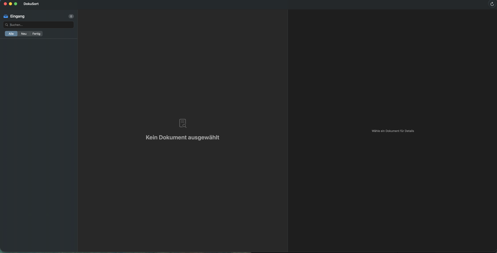

# DokuSort 📂✨

> **Intelligente, lokale Dokumentenverwaltung für macOS.**
> *Powered by Ollama & Apple Vision Framework.*

## Über DokuSort

DokuSort ist eine native macOS-Anwendung, die dein PDF-Chaos bändigt, ohne dass deine Daten deinen Mac verlassen. Die App überwacht einen Eingangsordner, analysiert Dokumente mittels lokaler KI (Ollama & Vision OCR) auf Absender, Datum und Typ und sortiert sie vollautomatisch in eine saubere Archivstruktur ein.

**Warum DokuSort?**
Niemand sortiert gerne Rechnungen. Cloud-Lösungen sind oft teuer oder datenschutzrechtlich bedenklich. DokuSort kombiniert die Power von LLMs mit der Privatsphäre einer lokalen App.

---

## 📑 Inhaltsverzeichnis

- [Features](#-features)
- [Screenshots](#-screenshots)
- [Für wen ist das?](#-für-wen-ist-das)
- [Tech Stack](#-tech-stack)
- [Voraussetzungen](#-voraussetzungen)
- [Mitwirken (Contributing)](#-mitwirken)
- [Lizenz](#-lizenz)

---

## 🚀 Features

* **🔒 Privacy First:** Keine Cloud. Die Analyse läuft lokal über Ollama (z.B. Llama 3) und Apples Vision Framework.
* **🧠 Smart Learning:** Die App merkt sich deine Korrespondenten. Dank Fuzzy-Matching (Levenshtein-Distanz) versteht sie, dass "Apple Distribution" und "Apple Inc." zusammengehören.
* **⚡️ Automatischer Workflow:**
    * Überwachung des "Scan"-Ordners.
    * Extraktion von Metadaten (Datum, Absender, Dokumenttyp).
    * Verschieben in Ordnerstruktur: `Archiv / [Jahr] / [Korrespondent] / [Datum]_[Typ].pdf`.
* **✍️ Volle Kontrolle:** Ein natives Dashboard erlaubt dir, Vorschläge zu korrigieren, bevor archiviert wird.

## 📸 Screenshots

> *Das Dashboard: Links die Dokumentenliste, rechts die KI-Vorschläge und Metadaten.*

## 🎯 Für wen ist das?

* **Entwickler & Techies**, die ihre Dokumentenablage automatisieren wollen, aber volle Kontrolle über den Code und die Modelle haben möchten.
* **Privacy-Enthusiasten**, die keine sensiblen Rechnungen an Cloud-APIs senden wollen.
* **Mac-User**, die eine native, schnelle Oberfläche (SwiftUI) bevorzugen.

## 🛠 Tech Stack

* **Sprache:** Swift 5.9+
* **UI Framework:** SwiftUI (macOS)
* **KI & Analyse:**
    * [Ollama](https://ollama.com/) (Lokale LLM Inference)
    * Apple Vision Framework (OCR)
    * `PDFKit` (Rendering & Metadaten)
* **Architektur:** MVVM, Swift Concurrency (`async/await`), Combine.
* **Datenhaltung:** JSON-Persistenz & FileSystem Monitoring (`DispatchSource`).

## ⚙️ Voraussetzungen

1.  **macOS 14.0+** (Sonoma oder neuer empfohlen).
2.  **Ollama** muss installiert sein und im Hintergrund laufen.
    * Download: [ollama.com](https://ollama.com)
    * Standard-Modell: `llama3.1` (in den App-Einstellungen änderbar).

## 🤝 Mitwirken

**Dieses Projekt steht noch am Anfang (Early Access / WIP)!**

Ich freue mich riesig über Feedback, Pull Requests oder Bug Reports.
Es gibt noch viel zu tun:
* Verbesserung der Prompt-Engineering Strategien.
* Erweiterung der unterstützten Dokumenttypen.
* UI-Polishing.

Fühl dich frei, das Repository zu forken und deine Ideen einzubringen!

## 📄 Lizenz

Siehe [LICENSE](LICENSE) Datei.

---
**Author:** Richard Sonderegger

--------------------------------------------------------------------------------------------------

# DokuSort 📂✨

> **Intelligent, local document management for macOS.**
> *Powered by Ollama & Apple Vision Framework.*

## About DokuSort

DokuSort is a native macOS application designed to tame your PDF chaos without your data ever leaving your machine. The app monitors an input folder, analyzes documents using local AI (Ollama & Vision OCR) to extract sender, date, and type, and automatically sorts them into a clean archive structure.

**Why DokuSort?**
Nobody likes sorting invoices. Cloud solutions are often expensive or raise privacy concerns. DokuSort combines the power of LLMs with the privacy of a local app.

---

## 📑 Table of Contents

- [Features](#-features)
- [Screenshots](#-screenshots)
- [Who is this for?](#-who-is-this-for)
- [Tech Stack](#-tech-stack)
- [Prerequisites](#-prerequisites)
- [Contributing](#-contributing)
- [License](#-license)

---

## 🚀 Features

* **🔒 Privacy First:** No Cloud. Analysis runs locally via Ollama (e.g., Llama 3) and Apple's Vision Framework.
* **🧠 Smart Learning:** The app remembers your correspondents. Thanks to fuzzy matching logic, it understands that "Apple Distribution" and "Apple Inc." belong to the same entity.
* **⚡️ Automated Workflow:**
    * Monitors your "Scan" folder.
    * Extracts metadata (Date, Sender, Document Type).
    * Moves files into a structured archive: `Archive / [Year] / [Correspondent] / [Date]_[Type].pdf`.
* **✍️ Full Control:** A native dashboard allows you to review and correct AI suggestions before archiving.

## 📸 Screenshots

> *The Dashboard: Document list on the left, AI suggestions and metadata on the right.*

## 🎯 Who is this for?

* **Developers & Techies** who want to automate their filing system while maintaining full control over code and models.
* **Privacy Enthusiasts** who don't want to send sensitive invoices to cloud APIs.
* **Mac Users** who prefer a native, performant interface (SwiftUI).

## 🛠 Tech Stack

* **Language:** Swift 5.9+
* **UI Framework:** SwiftUI (macOS)
* **AI & Analysis:**
    * [Ollama](https://ollama.com/) (Local LLM Inference)
    * Apple Vision Framework (OCR)
    * `PDFKit` (Rendering & Metadata)
* **Architecture:** MVVM, Swift Concurrency (`async/await`), Combine.
* **Persistence:** JSON persistence & FileSystem Monitoring (`DispatchSource`).

## ⚙️ Prerequisites

1.  **macOS 14.0+** (Sonoma or newer recommended).
2.  **Ollama** must be installed and running in the background.
    * Download: [ollama.com](https://ollama.com)
    * Default Model: `llama3.1` (configurable in App Settings).

## 🤝 Contributing

**This project is currently in Early Access / Work in Progress!**

Contributions are highly welcome. Whether it's a bug report, a feature request, or a pull request – I'd love to see what you can add.
Areas for improvement:
* Refining Prompt Engineering strategies.
* Expanding supported document types.
* UI Polishing.

Feel free to fork the repository and submit your PRs!

## 📄 License

See [LICENSE](LICENSE) file for details.

---
**Author:** Richard Sonderegger